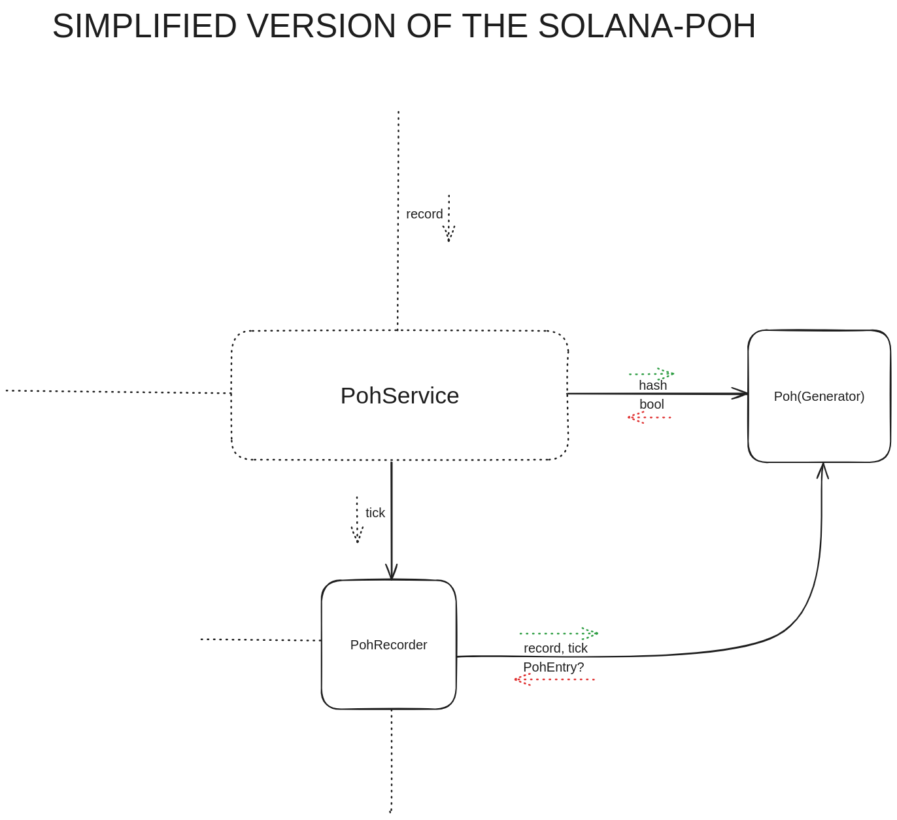

# solana-poh
Solana’s Proof-of-History (PoH) written in Zig

This project emulates the same logic to create a continuous PoH chain over time while
receiving hashes to mix into the chain.

### Build Dependencies

- Zig 0.12.0 - Choose one:
  - [Binary Releases](https://ziglang.org/download/) (extract and add to PATH)
  - [Install with a package manager](https://github.com/ziglang/zig/wiki/Install-Zig-from-a-Package-Manager)
  - Manage multiple versions with [zigup](https://github.com/marler8997/zigup) or [zvm](https://www.zvm.app/)


## Build

```bash
zig build
```

## Run

Run solana-poh with `zig` or execute the binary you already built:

```bash
zig build run
```

```bash
./zig-out/bin/solana-poh
```

## Documentation 



### What is PoH?
Solanas Proof of History (PoH) is a unique consensus mechanism aiming to help the blockchain achieve high throughput and scalability. It is not a consensus protocol, but a component used with the Proof of Stake (PoS) mechanism.

### How does PoH work?
PoH achieves high transaction speeds by generating a sequential hash, that serves as a verifiable record of time, allowing continuous transaction processing without waiting for consensus from other nodes on the network, reducing the communication needs.

Let’s delve into a few components inside the SOLANA codebase, starting with the core of the PoH generation, Poh generator.

Poh serves as the core generator for the Poh sequence, holding members for hash manipulation, one of its fields being of type Hash, which represents the actual hash sequence. Using its method hash, it enables us to create a repeating hash sequence by performing a SHA256 hash using its own current hash value as input, thus ensuring the sequence is unbreakable. It allows us to specify the number of hashes during the call, which can’t be more than the remaining hashes count - 1 (-1 to ensure a tick hash as well, talked about later). On each hash we increase the number of hashes count and decrease the remaining hashes count.

Poh also provides a record method which serves as the event engraver, taking the event hash and incorporating it in the already ongoing hash sequence, thus linking the event to the history of all previous events. This method creates a poh_entry for us that we can use in other parts of the project, holding the number of hashes from the last poh_entry.

Poh provides the tick method that generates a poh_entry as well, holding the current state of the hash chain, as well as number of hashes between the last poh_entry and this. Ticks serve as a timekeeping mechanism. After each the Poh generator get’s reset, resetting the remaining ticks, and number of hashes.

The generator would be nothing without the proper manipulation from a runner encapsulating it and feeding it with data. That’s where the PohService comes in place, joining forces with PohRecorder to ensure proper timing, hash calculation and record incorporation, as well as storage of events. PohService has its own worker thread, that runs separately from the other, initiating and overlooking the hashing, making sure ticks are produced as expected. PohService basically continuously initiates hash creation, keeping an eye on the Poh generator and making sure to initiate a tick over the PohRecorder when the generator get’s in a tick-ready state. It also makes sure to delay the hashing process to match the ideal time.

PohService is also constantly checking if there’s a record ready to be incorporated, listening to the TransactionRecorder over a channel. If there are events ready to be incorporated, it propagates the work for the PohRecorder, whose job is to initiate a record request towards the Poh generator, and storing the PohEntry as Entry with the current tick height (total number of ticks).
